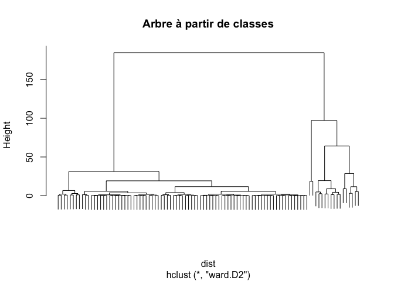

<h1 align="center">Projet de Clustering - EDF (sous R)</h1>
<!--<h2 align="center">Anass El Menan</h2>-->

<!--# Projet EDF (sous R) -->
<!-- <h1 align="center">Analyse de la consommation moyenne en électricité d'une maison (sous R)</h1>
<h2 align="center">Anass El Menan</h2> -->
Introduction
------------

Dans ce projet que nous propose EDF, nous disposons de données décrivant
chaque minute la consommation énergétique d’une maison sur une période
de quatre ans, soit de décembre 2006 à novembre 2010. Nous cherchons à
identifier les différents niveaux de consommation en utilisant des
méthodes de clustering, c’est-à-dire des méthodes de regroupement qui
permettent de partitionner les données en petits groupes, chaque groupe
correspondant à un niveau de consommation énergétique.

La base de données
------------------

Source : UCI Machine Learning Repository

<https://archive.ics.uci.edu/ml/datasets/Individual+household+electric+power+consumption>

La base de données est composée de 2 075 259 lignes et 9 colonnes.  
1.25% des lignes contiennent des valeurs manquantes.

<pre><code>library(knitr)
set.seed(123)

mydata = read.table("/Users/anasselmenan/Documents/Projet EDF/household_power_consumption.txt", 
                    sep = ";", header = TRUE, stringsAsFactors = FALSE)
echantillon = mydata[1:5, ]
kable(echantillon, caption = "Structure de la base de données")</code></pre>

<table>
<caption>Structure de la base de données</caption>
<thead>
<tr class="header">
<th style="text-align: left;">Date</th>
<th style="text-align: left;">Time</th>
<th style="text-align: left;">Global_active_power</th>
<th style="text-align: left;">Global_reactive_power</th>
<th style="text-align: left;">Voltage</th>
<th style="text-align: left;">Global_intensity</th>
<th style="text-align: left;">Sub_metering_1</th>
<th style="text-align: left;">Sub_metering_2</th>
<th style="text-align: right;">Sub_metering_3</th>
</tr>
</thead>
<tbody>
<tr class="odd">
<td style="text-align: left;">16/12/2006</td>
<td style="text-align: left;">17:24:00</td>
<td style="text-align: left;">4.216</td>
<td style="text-align: left;">0.418</td>
<td style="text-align: left;">234.840</td>
<td style="text-align: left;">18.400</td>
<td style="text-align: left;">0.000</td>
<td style="text-align: left;">1.000</td>
<td style="text-align: right;">17</td>
</tr>
<tr class="even">
<td style="text-align: left;">16/12/2006</td>
<td style="text-align: left;">17:25:00</td>
<td style="text-align: left;">5.360</td>
<td style="text-align: left;">0.436</td>
<td style="text-align: left;">233.630</td>
<td style="text-align: left;">23.000</td>
<td style="text-align: left;">0.000</td>
<td style="text-align: left;">1.000</td>
<td style="text-align: right;">16</td>
</tr>
<tr class="odd">
<td style="text-align: left;">16/12/2006</td>
<td style="text-align: left;">17:26:00</td>
<td style="text-align: left;">5.374</td>
<td style="text-align: left;">0.498</td>
<td style="text-align: left;">233.290</td>
<td style="text-align: left;">23.000</td>
<td style="text-align: left;">0.000</td>
<td style="text-align: left;">2.000</td>
<td style="text-align: right;">17</td>
</tr>
<tr class="even">
<td style="text-align: left;">16/12/2006</td>
<td style="text-align: left;">17:27:00</td>
<td style="text-align: left;">5.388</td>
<td style="text-align: left;">0.502</td>
<td style="text-align: left;">233.740</td>
<td style="text-align: left;">23.000</td>
<td style="text-align: left;">0.000</td>
<td style="text-align: left;">1.000</td>
<td style="text-align: right;">17</td>
</tr>
<tr class="odd">
<td style="text-align: left;">16/12/2006</td>
<td style="text-align: left;">17:28:00</td>
<td style="text-align: left;">3.666</td>
<td style="text-align: left;">0.528</td>
<td style="text-align: left;">235.680</td>
<td style="text-align: left;">15.800</td>
<td style="text-align: left;">0.000</td>
<td style="text-align: left;">1.000</td>
<td style="text-align: right;">17</td>
</tr>
</tbody>
</table>

> Description des variables

-   **Date** : date au format jj/mm/aaaa

-   **Time** : heure au format hh:mm:ss

-   **Global\_active\_power** : puissance active consommée par les
    ménages (kW)

-   **Global\_reactive\_power** : puissance réactive consommée par les
    ménages (kW)

-   **Voltage** : tension (V)

-   **Global\_intensity** : intensité du courant (A)

-   **Sub\_metering\_1** : sous-comptage d’énergie active n°1 (W.h) 
    
Il permet de suivre la consommation des différentes installations dans la cuisine comme le     lave-vaisselle, le four et le micro-ondes.

-   **Sub\_metering\_2** : sous-comptage d’énergie active n°2 (W.h)
    
Il permet de suivre la consommation des différentes installations dans la buanderie comme     le lave-linge, le sèche-linge, le réfrigérateur et la lampe.

-   **Sub\_metering\_3** : sous-comptage d’énergie active n°3 (W.h) 
    
Il permet de suivre la consommation du chauffe-eau électrique et du climatiseur.

Traitement des données
----------------------

Dans un premier temps, nous regardons le format des données.

<pre><code># Format des données
lapply(mydata, class)</code></pre>

    ## $Date
    ## [1] "character"
    ## 
    ## $Time
    ## [1] "character"
    ## 
    ## $Global_active_power
    ## [1] "character"
    ## 
    ## $Global_reactive_power
    ## [1] "character"
    ## 
    ## $Voltage
    ## [1] "character"
    ## 
    ## $Global_intensity
    ## [1] "character"
    ## 
    ## $Sub_metering_1
    ## [1] "character"
    ## 
    ## $Sub_metering_2
    ## [1] "character"
    ## 
    ## $Sub_metering_3
    ## [1] "numeric"

La plupart des variables sont de type &quot;character&quot;. Il est alors
nécessaire de changer le type &quot;character&quot; en &quot;numeric&quot; pour pouvoir
manipuler les données par la suite.

<pre><code>library(dplyr)
library(reshape2)

# Conversion des données en un objet tbl_df pour faciliter les manipulations avec les fonctions de dplyr
mydata = tbl_df(mydata)
# Conversion des données en numérique
mydata[, 3:9] = lapply(mydata[, 3:9], as.numeric)
# Format des données
lapply(mydata, class)</code></pre>

    ## $Date
    ## [1] "character"
    ## 
    ## $Time
    ## [1] "character"
    ## 
    ## $Global_active_power
    ## [1] "numeric"
    ## 
    ## $Global_reactive_power
    ## [1] "numeric"
    ## 
    ## $Voltage
    ## [1] "numeric"
    ## 
    ## $Global_intensity
    ## [1] "numeric"
    ## 
    ## $Sub_metering_1
    ## [1] "numeric"
    ## 
    ## $Sub_metering_2
    ## [1] "numeric"
    ## 
    ## $Sub_metering_3
    ## [1] "numeric"

Pour les données manquantes, nous décidons de supprimer les lignes
correspondantes en raison du très grand nombre de données à disposition.
Nous obtenons alors une base de données composée de 2 049 280 lignes et
9 colonnes.

<pre><code>mydata = mydata %>%
  na.omit(mydata)</code></pre>

Sélection de variables
----------------------

Dans le cadre de notre étude, nous utilisons deux variables :

-   la puissance réactive consommée 
-   l’énergie active consommée

À noter que l’énergie active consommée (W.h) est égale à :  

<math><strong>Global\_active\_power</strong> &times; 1000/60 - <strong>Sub\_metering\_1</strong> - <strong>Sub\_metering\_2</strong> - <strong>Sub\_metering\_3</strong></math>

<pre><code>Active_energy = mydata[, 3] * 1000/60 - mydata[, 7] - mydata[, 8] - mydata[, 9]
mynewdata = data.frame(matrix(NA, ncol = 4, nrow = nrow(mydata)))
mynewdata[, 1] = mydata[, 1]
mynewdata[, 2] = mydata[, 2]
mynewdata[, 3] = mydata[, 4]
mynewdata[, 4] = Active_energy
colnames(mynewdata) = c("Date", "Time", "Global_reactive_power", "Active_energy")
echantillon2 = mynewdata[1:5, ]
kable(echantillon2, caption = "Structure de la nouvelle base de données")</code></pre>

<table>
<caption>Structure de la nouvelle base de données</caption>
<thead>
<tr class="header">
<th style="text-align: left;">Date</th>
<th style="text-align: left;">Time</th>
<th style="text-align: right;">Global_reactive_power</th>
<th style="text-align: right;">Active_energy</th>
</tr>
</thead>
<tbody>
<tr class="odd">
<td style="text-align: left;">16/12/2006</td>
<td style="text-align: left;">17:24:00</td>
<td style="text-align: right;">0.418</td>
<td style="text-align: right;">52.26667</td>
</tr>
<tr class="even">
<td style="text-align: left;">16/12/2006</td>
<td style="text-align: left;">17:25:00</td>
<td style="text-align: right;">0.436</td>
<td style="text-align: right;">72.33333</td>
</tr>
<tr class="odd">
<td style="text-align: left;">16/12/2006</td>
<td style="text-align: left;">17:26:00</td>
<td style="text-align: right;">0.498</td>
<td style="text-align: right;">70.56667</td>
</tr>
<tr class="even">
<td style="text-align: left;">16/12/2006</td>
<td style="text-align: left;">17:27:00</td>
<td style="text-align: right;">0.502</td>
<td style="text-align: right;">71.80000</td>
</tr>
<tr class="odd">
<td style="text-align: left;">16/12/2006</td>
<td style="text-align: left;">17:28:00</td>
<td style="text-align: right;">0.528</td>
<td style="text-align: right;">43.10000</td>
</tr>
</tbody>
</table>

Clustering
----------

En utilisant les variables <strong>Global&lowbar;reactive&lowbar;power</strong> et
<strong>Active&lowbar;energy</strong>, nous allons maintenant partitionner les données en
petits groupes grâce à des méthodes de clustering. Dans notre cas,
chaque groupe correspond à un niveau de consommation énergétique.

Étant donné qu’il y a beaucoup d’individus statistiques dans la base de
données, nous allons d’abord faire une partition (par k-means) en une
centaine de classes. Puis nous allons construire une CAH (Classification
Ascendante Hiérarchique) à partir des classes, c’est-à-dire utiliser
l’effectif des classes dans le calcul.

Nous obtenons alors un arbre hiérarchique construit avec la distance euclidienne et le critère de Ward.

<pre><code># K-means
res.kmeans = kmeans(mynewdata[, 3:4], 100)

library("fastcluster")

# CAH
dist = dist(res.kmeans$centers)
cah = hclust(dist, method = "ward.D2")
# Dendrogramme
plot(cah, labels = FALSE, main = "Arbre à partir de classes")</code></pre>

Nous pouvons représenter le graphique des pertes relatives d’inertie. La
meilleure partition selon ce critère est représentée par un point noir
et la seconde par un point gris.

<pre><code>library(devtools)
install_github("larmarange/JLutils")
library("JLutils")

best.cutree(cah, min = 2, graph = TRUE, xlab = "Nombre de classes", ylab = "Inertie relative")</code></pre>

    ## [1] 2

Un découpage en deux classes minimise le critère. Cependant, si nous
souhaitons réaliser une analyse un peu plus fine, un nombre de classes
plus élevé serait pertinent. Nous allons donc retenir un découpage en
trois classes.

<pre><code>plot(cah, labels = FALSE, main = "Partition en trois classes", xlab = "", ylab = "", 
     sub = "", axes = FALSE, hang = -1)
rect.hclust(cah, 3, border = "green3")</code></pre>

Nous avons fait une classification d’individus statistiques. Ces
individus sont regroupés en trois classes. Nous cherchons maintenant à
comprendre ces classes. Autrement dit, nous cherchons à savoir ce qui
les caractérise.

Il y a donc une fonction dans la librairie FactoMineR qui permet de
caractériser une variable qualitative comme la variable de classe. C’est
la fonction catdes( ).

<pre><code>groups = cutree(cah, k = 3)
x = cbind(res.kmeans$centers, groups)
x = as.data.frame(x)
x$groups = as.factor(x$groups)

library("FactoMineR")

catdes(x, num.var = 3)</code></pre>

    ## 
    ## Link between the cluster variable and the quantitative variables
    ## ================================================================
    ##                    Eta2      P-value
    ## Active_energy 0.8497783 1.179066e-40
    ## 
    ## Description of each cluster by quantitative variables
    ## =====================================================
    ## $`1`
    ##                  v.test Mean in category Overall mean sd in category
    ## Active_energy -8.119726          6.24428     12.15642       3.150822
    ##               Overall sd      p.value
    ## Active_energy   16.00795 4.672361e-16
    ## 
    ## $`2`
    ##                 v.test Mean in category Overall mean sd in category
    ## Active_energy 5.949827         34.94338     12.15642       13.79245
    ##               Overall sd      p.value
    ## Active_energy   16.00795 2.684261e-09
    ## 
    ## $`3`
    ##                 v.test Mean in category Overall mean sd in category
    ## Active_energy 6.610874         86.60821     12.15642       9.274404
    ##               Overall sd      p.value
    ## Active_energy   16.00795 3.820576e-11

La variable <strong>Active&lowbar;energy</strong> est la seule variable pour laquelle le
test de liaison entre une variable qualitative et une variable quantitative est significatif.

-   
Quand la variable de classe est égale à 1, il s’agit d’un groupe
    d’individus statistiques où il y a une faible consommation d’énergie
    active.

-   
Quand la variable de classe est égale à 3, il s’agit d’un groupe d’individus statistiques 
    où la consommation d’énergie active est élevée.

-   
Enfin, quand la variable de classe est égale à 2, il s’agit d’un groupe d’individus 
    statistiques où la consommation d’énergie active est plus élevée par rapport à celle du groupe 1. Par contre,     elle est moins importante comparée à la consommation du groupe 3.

